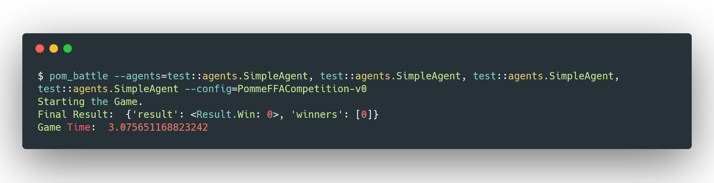
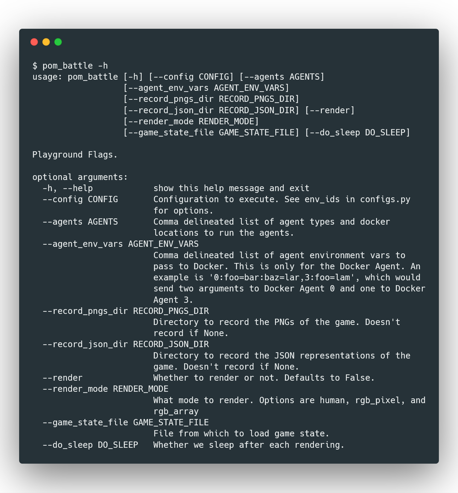

# Command-Line Interface
Pommerman comes with a CLI tool that allows you to quickly launch a game. This can be used to test how well a trained agent plays against other agents.  

Call this with a config, a game, and a list of agents. The script will start separate threads to operate the agents and then report back the result.  

An example with all four test agents running FFA:
```bash
pom_battle --agents=test::agents.SimpleAgent,test::agents.SimpleAgent,test::agents.SimpleAgent,test::agents.SimpleAgent --config=PommeFFACompetition-v0
```
An example with one player, two random agents, and one test agent:
```bash
pom_battle --agents=player::arrows,test::agents.SimpleAgent,random::null,random::null --config=PommeFFACompetition-v0
```
An example with a docker agent:
```bash
pom_battle --agents=player::arrows,docker::pommerman/test-agent,random::null,random::null --config=PommeFFACompetition-v0
```
*Output of the 1st example*  
## Configurations and Options
To get a list of active options you can run `pom_battle --help`. The current list of parameters is:  
* `--game`: Allows you to change the game your agent plays. The default is `pommerman`. Currently only supports `pommerman`  

* `--config`: Changes the type of game the agents will play. The default is `PommeFFACompetition-v0`. Other options are `PommeFFACompetition-v0`, `PommeFFAFast-v0`, `PommeFFA-v1`, `PommeRadio-v2`, `PommeTeam-v0`, `PommeTeamFast-v0` and `OneVsOne-v0`.  

* `--agents`: Defines the agents participating in the game. The default is 4 simple agents. To changes the agents in the game use a comma delineated list of agent.  

* `--agent_env_vars`: Sends enviroment variables to to Docker agents and only Docker agents. The default is "". An example is '0:foo=bar:baz=lar,3:foo=lam', which would send two arguments to Docker Agent 0 and one to Docker Agent 3.  

* `--record_pngs_dir`: Defines the directory to record PNGs of the game board for each step. The default is `None`. If the directory doesn't exist, it will be created. The PNGs are saved with the format `%m-%d-%y_%-H-%M-%S_(STEP).png` (`04-17-18_15-54-39_3.png`).  

* `--record_json_dir`: Defines the directory to record the JSON representations of the game. The default is `None`. If the directory doesn't exist, it will be created.

* `--render`: Allows you to turn of rendering of the game. The default is `False`.  

* `--render_mode`: Changes the render mode of the game. The default is `human`. Available options are `human`, `rgb_pixel`, and `rgb_array`.  

* `--game_state_file`: Changes the initial state of the game. The file is expected to be in JSON format.  The format of the file is defined below.  
    * `agents`: List of agents serialized (agent_id, is_alive, position, ammo, blast_strength, can_kick)
    * `board`: Board matrix topology (board_size<sup>2</sup>)
    * `board_size`: Board size
    * `bombs`: List of bombs serialized (position, bomber_id, life, blast_strength, moving_direction)
    * `flames`: List of flames serialized (position, life)
    * `items`: List of item by position
    * `step_count`: Step count

*Output of help from pom_battle*
## Training an agent using Tensorforce
Pommerman comes with a trainable agent out of the box. The agent uses a Proximal Policy Optimization (PPO) algorithm. This agent is a good place to start if you want to train your own agent. All of the options that are available in the CLI tool are available in the Tensorforce CLI.    
An example with all three simple agents running FFA:
```bash
pom_tf_battle --agents=tensorforce::ppo,test::agents.SimpleAgent,test::agents.SimpleAgent,test::agents.SimpleAgent --config=PommeFFACompetition-v0
```