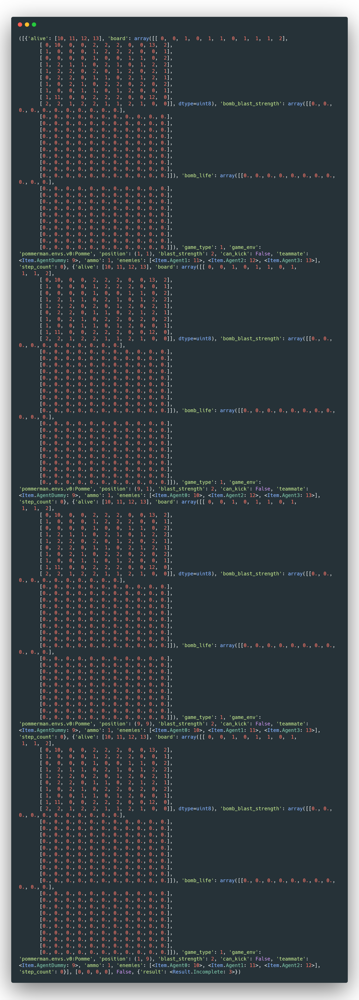

# Environment Reference
## Parameters
These are parameters for `pommerman.make`:
### Configurations
Configurations that are included in Pommerman. This is the `config_id` parameter of `pommerman.make` as a String:  

* `PommeFFACompetition-v0` - In this all agents are against each other  
* `PommeTeamCompetition-v0` - In this teams of two agents each are set against each other. The teams are [Agent0, Agent2] and [Agent1, Agent3]  
* `OneVsOne-v0` - In this two agents are against each other  
* `PommeFFA-v1` - In this all agents are against each other while the board collapses uniformly by replacing the outermost square with walls  
* `PommeTeamCompetition-v1` - This is similar to PommeFFA-v1 but with Teams instead of being Free-For-All  
* `PommeRadio-v2` - This is similar to `PommeTeamCompetition-v0` but the agents can send a list of two integers in the range [1, 8] to their teammates on every turn.

### Agents
Agent classes that are included in Pommerman. This is the `agent_list` parameter of `pommerman.make` as a list of 4 agent classes. All of these can be found under `pommerman.agents`:  

* `base_agent` - This is the class that all agents inherit from   
* `random_agent` - This randomly selects an action and plays it out  
* `simple_agent` - This is an agent based on a non-ML approach (This agent is prone to killing itself)   
* `tensorforce_agent` - This agent calls [TensorForce](https://github.com/reinforceio/tensorforce) to return an action  
* `player_agent` - This is an agent controlled by an keyboard. You can change the control scheme by feeding the `agent_control` parameter as either: `"arrows"` for Arrows = Move and Space = Bomb or `"wasd"` for W,A,S,D = Move, E = Bomb  
* `http_agent` - This agent outputs to accepts input in the form of a REST requests to it  
* `docker_agent` - This agent outputs and accepts inputs to an agent wrapped inside a Docker container  
## Output
 *This is the output from env.step()*  

It has the following format:

* Board: The 11x11 board is a numpy array where each value corresponds to one of the representations below. The first element in this 2D array corresponds to the configuration of topmost row of the board and so on.
    * Passage = 0
    * Wooden Wall = 1
    * Rigid Wall = 2
    * Bomb = 3
    * Flames = 4
    * Fog = 5: This is only applicable in the partially observed (2v2 Team Radio) setting.
    * Extra Bomb Power-Up = 6: adds ammo.
    * Increase Range Power-Up = 7: increases the blast_strength
    * Can Kick Power-Up = 8: can kick bombs by touching them.
    * AgentDummy = 9
    * Agent0 = 10
    * Agent1 = 11
    * Agent2 = 12
    * Agent3 = 13
* Position: A tuple of Ints of (X position, Y position)
* Ammo: An Int representing the amount of ammo this agent has. 
* Blast Strength: An Int representing the blast strength of this agent's bombs.
* Can Kick: Whether this agent can kick bombs. This ability is gained by stepping on the can kick power-up.
* Teammate: One Int in [9, 13].  Which agent is this agent's teammate. In the FFA game, this is the AgentDummy.
* Enemies: A list of three Ints, each in [9, 13]. Which agents are this agent's enemies. There are three here to be amenable to all variants of the game. When there are only two enemies like in the team competitions, the last Int will be the AgentDummy to reflect the fact that there are only two enemies.
* Bomb Blast Strength: An 11x11 numpy int array representing the bombs' blast strengths in the agent's view. Everything outside of its view will be fogged out.
* Bomb Life: An 11x11 numpy int array representing the bombs' life in the agent's view. Everything outside of its view will be fogged out.
* Bomb Movement Direction: An 11x11 numpy int array representing the bombs' movement direction (in terms of an agent's action space: 1 -> up, 2 -> down etc...) in the agent's view. Everything outside of its view will be fogged out.
* Flame Life: An 11x11 numpy int array representing the flames' life in the agent's view. Everything outside of its view will be fogged out.
* Message: (Team Radio only) A list of two Ints, each in [0, 8]. The message being relayed from the teammate. Both ints are zero when a teammate is dead or it's the first step. Otherwise they are in [1, 8].
