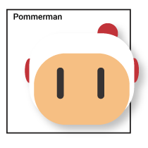

# Pommerman

## Introduction
We are machine learning researchers exploring how to train agents that can operate in environments with other learning agents, both cooperatively and adversarially. Whether you are a student or a well-oiled machine, we want you to help us advance the state of the art by building agents.

## How do I get help ?
Join our Discord chat and check out the Github, which has all the instructions and details for training an agent in the environment and then submitting it to compete on [competitions](competitions.md).  

* [GitHub](https://github.com/MultiAgentLearning/playground)  
* [Discord](https://discord.gg/wjVJEDc)  
  
## What's in the docs ?  
* [Getting Started](getting_started.md)  
* [Command Line Interface](CLI.md)  
* [Multiplayer](multiplayer.md)  
* [Competitions](competitions.md)  
* [Environment Reference](environment.md)  
* [Research Topics](research.md)  