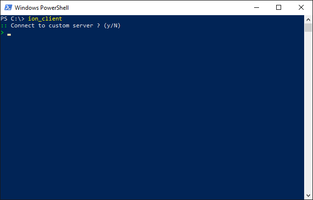
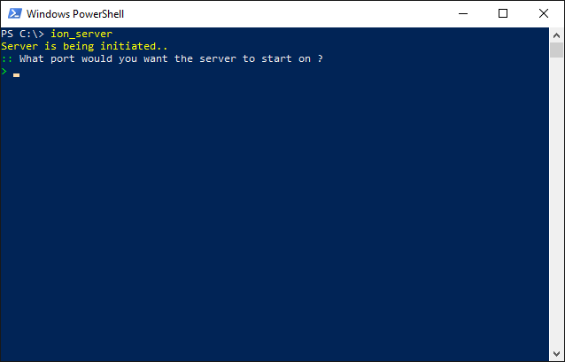

# Multiplayer
Pommerman comes with a multiplayer integrated into it. It has two components a Client and a Server:
## Client
### CLI
This is primarily for a single or a few matches. It can be launched using `ion_client`.  
#### GIF:

### API
This is for running a sizable amount of matches. It can be accessed by `pommerman.network.ion_client`. 

#### Code Example:
```python
import pommerman.network.client as client
import pommerman.agents.SimpleAgent

matches=10 # Amount of matches to play

net = client.Network() # This is essentially a single player to the server. If you want to have multiple players use one for each player.
results = {"reward":[], "match_id":[]} # Note: We save match ID so we can view replays later
for i in range(matches):
    reward, match_id = client.match(network=net, room=False, agent=SimpleAgent)
    # or client.match(network=net, room="someroom", agent=SimpleAgent)
    results.reward.append(reward)
    results.match_id.append(match_id)
print(f"Average reward: {sum(result.reward)/len(result.reward)}")
print("The match IDs of played matches:")
for i in range(matches):
    print(f"{i+1}. {result.match_id[i]}")
```
## Server
### CLI
This launches a Server. It can be launched using `ion_server`.  
#### GIF:

### API
This programatically launches a Server. It can be accessed by `pommerman.network.server`.  
#### Code Example:
```python
import pommerman.network.server as server

while True: # Re-run the server incase it crashes (This is not actually recommended because you should investigate the error)
    try:
        server.run(port=5050, max_players=8, timeout=1, mode="PommeTeamCompetition-v0")
    except:
        print("The server has crashed")
```