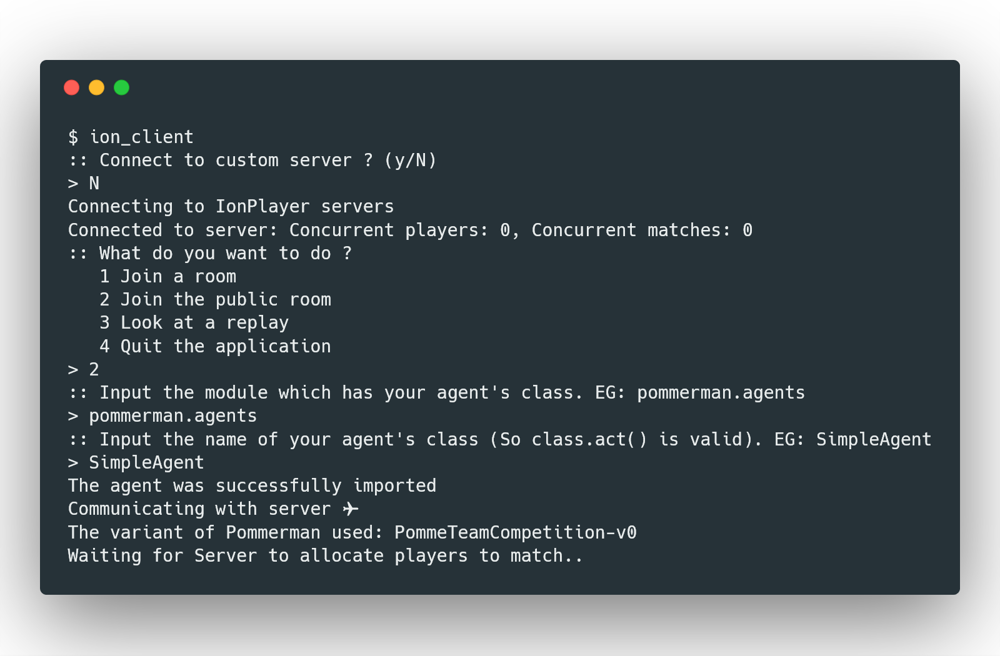
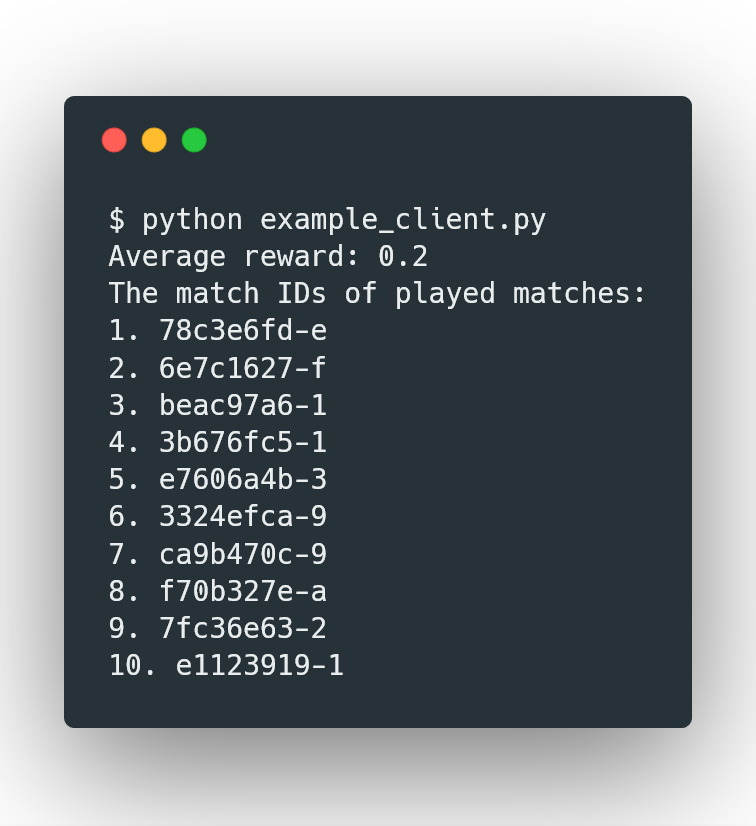
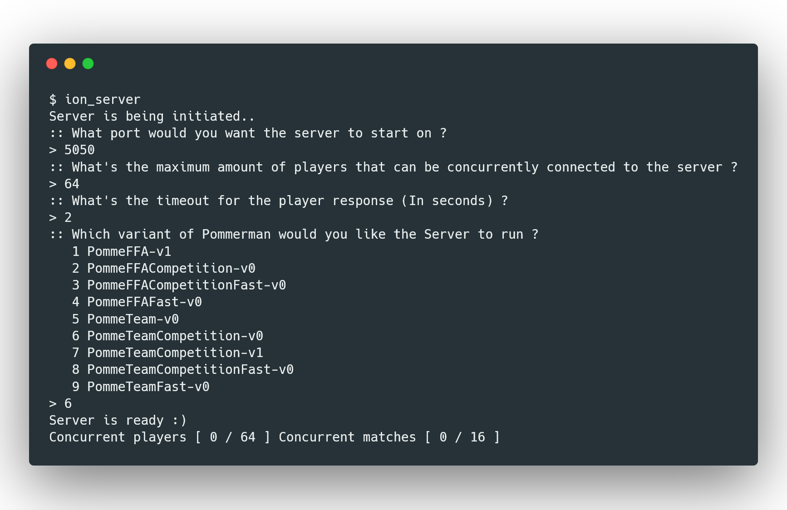
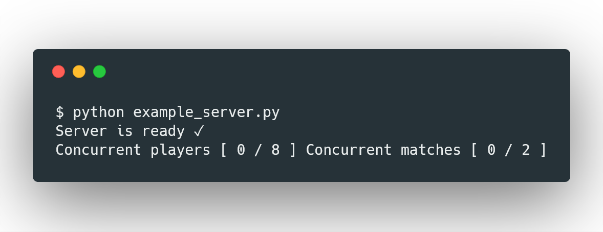

# Multiplayer
The multiplayer component of Pommerman has two components a Client and a Server:
## Client
### CLI
This is primarily for a single or a few matches. It can be launched using `ion_client`.  
#### Output

### API
This is for running a sizable amount of matches. It can be accessed by `pommerman.network.ion_client`. 

#### Code Example
```python
#!/usr/bin/python
import pommerman

matches=10 # Amount of matches to play

net = pommerman.network.client.Network("play.pommerman.com:5050") # This is essentially a single player to the server. If you want to have multiple players use one for each player.
result = {"reward":[], "match_id":[]} # Note: We save match ID so we can view replays later
for i in range(matches):
    reward, match_id = pommerman.network.client.match(network=net, room=False, agent=pommerman.agents.SimpleAgent)
    # or pommerman.network.client.match(network=net, room="someroom", agent=pommerman.agents.SimpleAgent)
    result["reward"].append(reward)
    result["match_id"].append(match_id)
print(f"Average reward: {sum(result['reward'])/len(result['reward'])}")
print("The match IDs of played matches:")
for i in range(matches):
    print(f"{i+1}. {result['match_id'][i]}")
```
#### Output

## Server
### CLI
This launches a Server. It can be launched using `ion_server`.  
#### Output

### API
This programatically launches a Server. It can be accessed by `pommerman.network.server`.  
#### Code Example
```python
#!/usr/bin/python
import pommerman

if __name__ == '__main__':
    while True: # Re-run the server incase it crashes (This is not actually recommended because you should investigate the error)
        try:
            pommerman.network.server.run(port=5050, max_players=8, timeout=2, mode="PommeTeamCompetition-v0", ui_en=True)
        except Exception as e:
            print(f"The server has crashed. The exception was {e}")
```
#### Output
